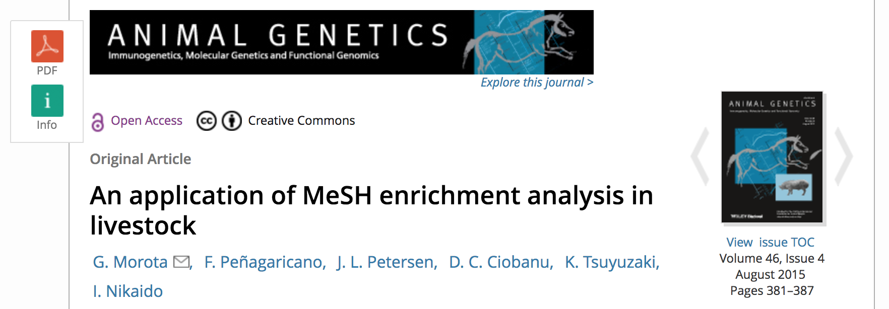
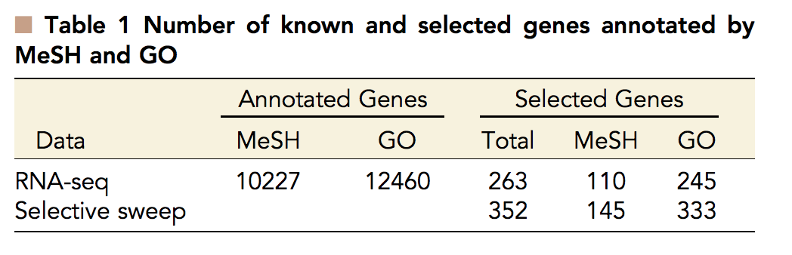

```{r setup, include=FALSE}
options(htmltools.dir.version = FALSE)
```


# Medical Subject Headings (MeSH)

- collection of a comprehensive life sciences vocabulary 

- used for indexing articles in MEDLINE database (PubMed)

- includes over 26,000 terms (as of 2011)

- 10 $\sim$ 15 MeSH headings per article

<div align="center">

   <figcaption>NCBI MeSH website</figcaption>
</div>


---

# Medical Subject Headings (MeSH)
<div align="center">

   <figcaption>Paper in PubMed</figcaption>
</div>


---

# Medical Subject Headings (MeSH)
<div align="center">

   <figcaption>MeSH terms</figcaption>
</div>


---

# MeSH term-based search
Enhances PubMed search
<div align="center">

   <figcaption>MeSH terms</figcaption>
</div>


---

# MeSH term-based search (cont.)
Enhances PubMed search
<div align="center">

   <figcaption>MeSH terms</figcaption>
</div>


---

# MeSH Categories
<div align="center">

   <figcaption>Tsuyuzaki et al. (2015) </figcaption>
</div>


---
# Gene Ontology (GO)
GO terms are assigned to genes according to 

- biological process

- molecular function

- cellular component

It helps to understand biological interpretation of genes, however,

- GO is restricted to specific ontology

- MeSH contains terms regarding other concepts such as Diseases, Chemicals and Drugs, and Biological Phenomena


---
# MeSH enrichment analysis
**Hypergeometric test**
<div align="center">

</div>

- $S$ is the total number of selected genes

- $N$ is the total number of analyzed genes

- $k$ is the total number of genes in the MeSH term under study

- $g$ is the total number of selected genes in the MeSH term


---
# Hypergeometric test 
<div align="center">

</div>


---

# Hypergeometric test (Example)
The p-value is the probability of getting `g` or more annotated selected genes in a sample of size `S` from a sample of background genes with `k` annotated genes and `N-k` non-annotated genes.
```{r, eval=FALSE, echo=TRUE}
S <- 300
N <- 20000
k <- 2500
g <- 50
# 1
sum(dhyper(g:min(S,k), k, N-k, S))
[1] 0.02031964
phyper(g-1, k, N-k, S, lower.tail=FALSE)
[1] 0.02031964
# 2
1 - sum(dhyper(0:g-1, k, N-k, S))
[1] 0.02031964
1 - phyper(g-1, k, N-k, S)
[1] 0.02031964
```

---
# Number of background genes matters 
```{r, eval=TRUE, echo=TRUE}
S <- 300
k <- 2500
g <- 50

N <- 10000; 1 - phyper(g-1, k, N-k, S)
N <- 15000; 1 - phyper(g-1, k, N-k, S)
N <- 20000; 1 - phyper(g-1, k, N-k, S)
```


---
# MeSH ORA framework in Bioconductor
<div align="center">

   <figcaption>Tsuyuzaki et al. (2015) </figcaption>
</div>


---
# Entrez Gene ID $\longleftrightarrow$ MeSH ID
<div align="center">

   <figcaption>Tsuyuzaki et al. (2015) </figcaption>
</div>


---
# Bioconductor packages
Cattle annotation package 
<div align="center">

</div>
Statistical analysis package
<div align="center">

</div>


---
# Example code
```{r, eval=FALSE, echo=TRUE}
library("meshr")
library("MeSH.db")
library("MeSH.Bta.eg.db")

meshParams <- new("MeSHHyperGParams", geneIds = my.geneID3, 
                 universeGeneIds = univ.geneID3, 
                annotation = "MeSH.Bta.eg.db", 
                category = "D", database = "gene2pubmed", 
                pvalueCutoff = 0.05, pAdjust = "none")

meshR <- meshHyperGTest(meshParams)

head(summary(meshR))
MESHID Pvalue OddsRatio ExpCount Count Size    MESHTERM            GENEID SOURCEID
D015815 5.00e-06  12.2754 0.696    7    39 Cell Adhesion Molecules 404118 23800882
D015815 5.00e-06  12.2754 0.696    7    39 Cell Adhesion Molecules 538486 15117967
D015815 5.00e-06  12.2754 0.696    7    39 Cell Adhesion Molecules 281485 15117967
```


---
# Visualization for MeSH enrichment analysis 
```{r eval=FALSE, echo=TRUE}
tagcloud(mesh.tags, weights=weights, col=colors, order="size") 
```
<div align="center">

</div>


---
# MeSH analysis in mammalian livestock
Morota et al. (2015)
<div align="center">

</div>

- Dairy Cattle - genes that showed differential expression in preimplantation embryos due to maternal methionine supplementation (Penagaricano et al., 2013)

- Swine - genes related to age at puberty in swine (Tart et al., 2013)

- Horse - genes under selection in Quarter Horse (Petersen et al., 2013)


---
# Number of annotated genes in cattle, swine, and horse
<div align="center">

   <figcaption>Morota et al. (2015) </figcaption>
</div>


---
# Dairy Cattle - RNA-Seq
<div align="center">

   <figcaption>Morota et al. (2015) </figcaption>
</div>


---
# Swine - GWAS
<div align="center">

   <figcaption>Morota et al. (2015) </figcaption>
</div>


---
# Horse - Selection signature
<div align="center">

   <figcaption>Morota et al. (2015) </figcaption>
</div>


---
# MeSH analysis in chicken
Morota et al. (2016)
<div align="center">

</div>

- Differential expression in abdominal fat tissue between high and low feed efficiency broiler chickens (Zhuo et al., 2015)

- Candidate genes historically impacted by selection in 72 different chicken breeds (Beissinger et al., 2015)


---
# MeSH annotation of the chicken genome
Number of known and selected genes annotated by MeSH (Medical Subject Headings) and GO (Gene Ontology).

<div align="center">

</div>


---
# Significant MeSH terms 

<div align="center">

</div>


---
# MeSH semantic similarity - information content

- semantic similarity among MeSH terms

- semantic similarity among genes

- information content-based measure

<div align="center">

   <figcaption>Morota et al. (2016) </figcaption>
</div>


---
# MeSH semantic similarity (RNA-seq)
Chemicals and Drugs
<div align="center">

   <figcaption>Morota et al. (2016) </figcaption>
</div>


---
# MeSH semantic similarity (selective sweep)
Chemicals and Drugs
<div align="center">

   <figcaption>Morota et al. (2016) </figcaption>
</div>


---
# Gene semantic similarity (RNA-seq) 
<div align="center">

   <figcaption></figcaption>
</div>


---
# Gene semantic similarity (selective sweep)
<div align="center">

</div>


---
# Application to Nellore cattle (1)
G. A. Oliveira Júnior et al. (2017) ([doi:10.2527/jas2017.1752](https://doi.org/10.2527/jas2017.1752))
<div align="center">

</div>

---
# Application to Nellore cattle (2)
Mota et al. (2017) ([doi:10.1017/S1751731117001562](
https://doi.org/10.1017/S1751731117001562))
<div align="center">

</div>


---
# MeSH analysis in maize
Beissinger and Morota. (2016) ([doi:10.1186/s13007-017-0159-5](https://doi.org/10.1186/s13007-017-0159-5))
<div align="center">

</div>


- regions under selection during maize **domestication** (Hufford et al., 2012)
- regions under selection during maize **improvement** (Hufford et al., 2012)
- regions under selection for **seed size** (Hirsch et al., 2014)
- regions under selection for **ear number** (Beissinger et  al., 2014) 
- regions contributing to **inflorescence** traits (Brown et al.,2011)


---
# MeSH enrichment analysis (maize)
<div align="center">

   <figcaption></figcaption>
</div>


---
# MeSH semantic similarity (maize)
<div align="center">

   <figcaption></figcaption>
</div>


---
# Pitfalls 

What are the pitfalls in MeSH / GO analysis?

- significant MeSH or GO terms can arise from a random set of genes

- easy to make biological sense out of the false-positives 

- inferring the molecular mechanism on the basis of statistically significant MeSH or GO annotations alone is  potentially error-prone

Literature 

- Pavlidis et al. (2012). A critical assessment of storytelling: gene ontology categories and the importance of validating genomic scans. MBE. [doi:10.1093/molbev/mss136](https://doi.org/10.1093/molbev/mss136)


---
# Summary 
MeSH 

- share similar concepts derived from GO annotations

- able to draw additional information not directly provided by GO

- supplementary tool to GO analysis

- <span style="color:red">good tool for generating hypotheses</span>


    


